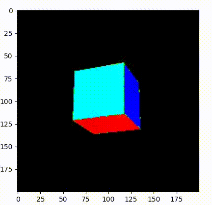
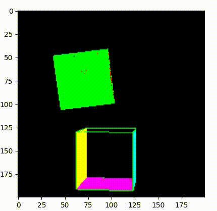
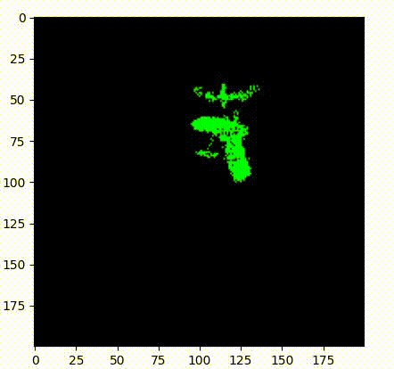

# Simple Python 3D Renderer

## Overview
This project is a Python-based 3D renderer that visualizes rotating cubes and other 3D objects using basic linear algebra and projection techniques. The renderer supports real-time rotation, depth buffering, and rendering multiple objects with different transformations.

## Features
- **3D Object Rotation**: Rotate cubes and other 3D objects around their center along different axes.
- **Customizable Camera**: Define the camera's position and normal vector for rendering.
- **Depth Buffering**: Uses a z-buffer to correctly render objects based on depth.
- **GPU Acceleration**: Supports optional GPU-based rendering for performance improvements.
- **PLY File Support**: Import and render 3D models in PLY format.

## Dependencies
Ensure you have the following dependencies installed before running the project:
```sh
pip install numpy
```

## Usage
1. Clone the repository:
```sh
git clone https://github.com/your-repo/3d-cube-renderer.git
cd 3d-cube-renderer
```
2. Run the main script:
```sh
python 'main (v4).py'
```

## File Structure
- `cube.py`: Defines the `Cube` class, which manages vertices, edges, and faces.
- `screen.py`: Handles rendering and projection of 3D objects onto a 2D plane.
- `utils/ply_reader.py`: Reads and processes `.ply` files for 3D model rendering.
- `main.py`: The entry point that initializes objects and renders them.

## Example

### Single Cube Rotation


### Multiple Cube Rotation


### PLY File Support



## Future Improvements
- Implement additional lighting effects.
- Add support for more complex 3D models and textures.
- Fix issues with object rotation and depth buffering.
